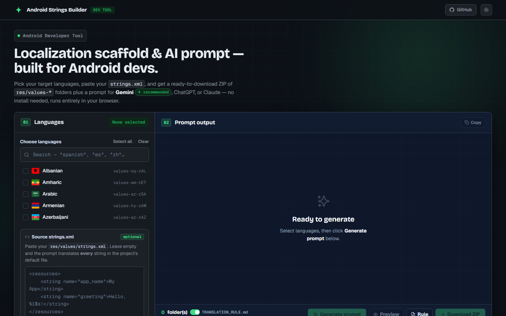
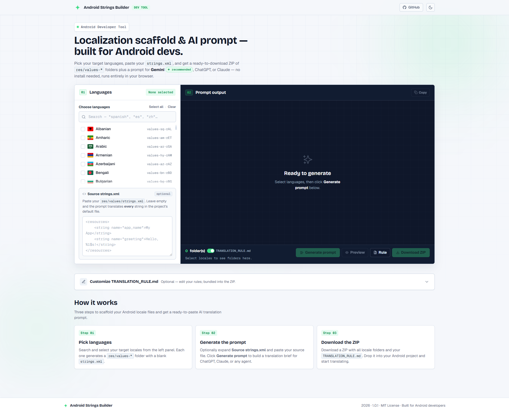

# Android Strings Builder

> Scaffold Android `res/values-*` locale folders and generate a ready-to-paste AI translation prompt — no install, runs entirely in your browser.

---

## Screenshots

### Dark mode (default)


### Light mode


> **Tip:** Add your own screenshots to `docs/screenshots/` and update the paths above.

---

## What it does

1. **Pick languages** — choose from 60+ locales with country flags and Android resource qualifiers (`values-es-rES`, `values-zh-rCN`, …)
2. **Paste your `strings.xml`** *(optional)* — or leave it empty to let the AI translate the whole project
3. **Download a ZIP** — instantly get a scaffold ZIP with one blank `strings.xml` per selected locale, ready to drop into your Android project
4. **Copy the AI prompt** — a structured prompt (Gemini ✦ recommended, ChatGPT, or Claude) that instructs the model to follow your `TRANSLATION_RULE.md` translation guidelines

---

## Features

| Feature | Details |
|---|---|
| 60+ locales | All major Android-supported languages with correct resource qualifiers |
| ZIP scaffold | `res/values-{locale}/strings.xml` blank templates in one click |
| AI prompt builder | Pre-filled prompt with 10+ years senior specialist persona |
| TRANSLATION_RULE.md | Editable translation guidelines, downloadable separately |
| Dark / Light mode | Defaults to dark, persists across sessions |
| Zero dependencies | No npm, no build step, no server |
| Privacy | No data ever leaves your device (see [Privacy](#privacy)) |

---

## Tech stack

| Technology | Role |
|---|---|
| HTML / CSS / JavaScript | Core — no framework, no build tool |
| [JSZip](https://stuk.github.io/jszip/) | Build the ZIP archive in-browser |
| [FileSaver.js](https://github.com/eligrey/FileSaver.js) | Trigger the file download |
| [marked.js](https://marked.js.org/) | Live Markdown preview for TRANSLATION_RULE.md |
| [flag-icons](https://github.com/lipis/flag-icons) | Country flag SVGs via CSS classes |
| [Bricolage Grotesque / Geist](https://fonts.google.com/) | Typography (Google Fonts) |
| CSS custom properties | Theming — dark/light mode via `[data-theme]` |
| `localStorage` | Persist theme preference only |

---

## Getting started

### Option 1 — Open directly (no server needed)

```
git clone https://github.com/mihphu/android-strings-builder.git
```

Then open `index.html` in your browser. Works on `file://` with no server required.

### Option 2 — Local dev server (optional, for fetch() to load TRANSLATION_RULE.md)

```bash
# Python 3
python -m http.server 8080

# Node.js (npx)
npx serve .
```

Then visit `http://localhost:8080`.

---

## Deploy to GitHub Pages

### Step 1 — Fork or push to GitHub

If you cloned the repo, create a new GitHub repository and push:

```bash
git remote set-url origin https://github.com/<your-username>/<your-repo>.git
git push -u origin main
```

### Step 2 — Enable GitHub Pages

1. Go to your repository on GitHub
2. Click **Settings** → **Pages** (left sidebar)
3. Under **Source**, select **Deploy from a branch**
4. Choose branch: `main`, folder: `/ (root)`
5. Click **Save**

### Step 3 — Access your site

After ~1–2 minutes, your site will be live at:

```
https://<your-username>.github.io/<your-repo>/
```

GitHub Pages serves static files directly — no server configuration needed.

---

## Project structure

```
android-strings-builder/
├── index.html              # Single-page app
├── style.css               # All styles (CSS custom properties, dark mode)
├── version.js              # App version — auto-incremented by pre-commit hook
├── TRANSLATION_RULE.md     # Default AI translation guidelines
├── js/
│   ├── app.js              # App logic — language picker, ZIP builder, prompt generator
│   └── data.js             # Locale catalogue (60+ languages)
└── .git/hooks/
    └── pre-commit          # Auto-increments patch version on every commit
```

---

## Usage guide

### 1. Select target languages

- Use the **search bar** to filter by language name, code, or resource qualifier
- Click **Select all** to pick all filtered results
- Each selected locale shows as a chip in the export bar

### 2. (Optional) Paste source strings

Paste your `res/values/strings.xml` into the **Source strings** box.  
Leave it empty and the AI prompt will instruct the model to translate every string in the project's default file.

### 3. Customize translation rules

The **Customize TRANSLATION_RULE.md** section (panel 03) lets you edit the guidelines the AI must follow — tone, placeholders, do-not-translate terms, etc.  
Click **Download rule** to save it separately.

### 4. Generate the AI prompt

Click **Generate prompt**, then **Copy** to copy it to your clipboard.  
Paste it into **Gemini** (recommended — built into Android Studio), ChatGPT, or Claude.

### 5. Download the ZIP

Click **Download ZIP** to get a scaffold archive with:

```
android-strings.zip
├── TRANSLATION_RULE.md        (if the toggle is on)
├── values-es-rES/
│   └── strings.xml
├── values-fr-rFR/
│   └── strings.xml
└── ...
```

Drop the extracted folders into your Android project's `app/src/main/res/` directory.

---

## Privacy

**This tool collects zero data.**

- Everything runs **locally in your browser** — no server, no backend, no API calls
- Your `strings.xml` content, selected languages, and translation rules **never leave your device**
- No analytics, no tracking scripts, no cookies
- The only external requests are loading fonts and flag icons from CDN on first visit
- Safe to use with proprietary or confidential string resources

---

## Version

The patch version auto-increments on every `git commit` via the `.git/hooks/pre-commit` hook.  
The current version is displayed in the app footer.

---

## License

MIT — free to use, modify, and distribute.

---

*Built for Android developers · Gemini ✦ recommended for in-IDE translation*
